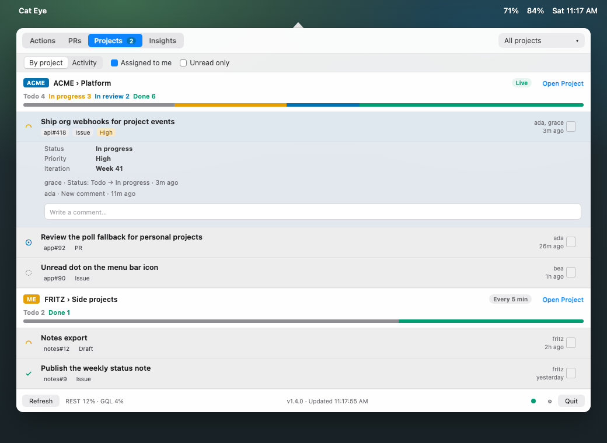

# Cat Eye — GitHub Actions & PR Monitor for macOS

> A lightweight, native macOS menu bar app for monitoring GitHub Actions, pull request reviews, Projects, and weekly CI health. Open source, about 1.3 MB, accessible, zero Electron.

The octocat's eye never blinks.

**There are plenty of GitHub status apps out there.** Most are Electron wrappers that eat 200MB+ of RAM to show you a green checkmark. Cat Eye exists because a status indicator shouldn't cost more than the IDE it sits next to.

Cat Eye is built on three principles:

- **Extremely low footprint** — a native Swift binary of about 1.3 MB, ~35MB of RAM, zero frameworks beyond AppKit. No runtime, no bundled browser, no background bloat.
- **Minimalist** — just the important information: are your Actions passing, do any PRs need your review, and did a tracked project change. Deeper stats live behind the Insights tab, so the default view stays a status light, not a dashboard.
- **Accessible** — colour is never the only signal. Status uses the Okabe-Ito colour-blind-safe palette plus shape and text cues, and everything is keyboard navigable.

| Actions tab | Pull Requests tab | Projects tab |
|:-----------:|:-----------------:|:------------:|
|  |  |  |

## Features

### Actions Tab
- **Live status icon** — GitHub mark tinted by status, with a small badge glyph (check / cross / hourglass) so state is readable without colour
- **Pulsing animation** — icon gently pulses when any action is actively running
- **Rich popover** — scrollable list of recent runs across all your repos, styled like the GitHub Actions UI
- **Per-run details** — workflow name, run number, branch badge, timestamps, and duration
- **Expandable run rows** — click a run to expand it inline: failed runs show the exact failure annotations (job/step + message), successful runs show the full commit message and durations, in-progress runs show live elapsed time and per-workflow status
- **Calculated ETA** — estimates remaining time for running actions based on historical durations
- **macOS notifications** — alerts for the run events you choose: starts, passes, failures, cancellations, and other endings — click a notification to open the popover

### Pull Requests Tab
- **Review queue** — shows PRs where your review is requested, across all tracked repos
- **Expandable detail** — click any PR to expand inline with full description and labels
- **PR actions** — approve, request changes, comment, merge (merge/rebase/squash), or close — all from the menu bar
- **Inline comments** — type and submit comments without leaving the popover
- **Safe input** — popover won't dismiss while you're typing a comment

### Projects Tab
- **Boards you already use** — GitHub Projects (v2) from your user account and from your organizations, in one tab
- **By project or activity** — status chips and a stacked bar per project, or a feed of what changed
- **Item preview** — status, fields, assignees, and the latest comment. Expand a row for the timeline
- **Change it in place** — set the status, edit the title and description, or comment, without leaving the menu bar
- **New item** — click **+** next to the filter, or press ⌘N. Make a draft, or an issue in a repo. Set the status and the other single-select fields
- **Start** — ▶ Start sets the first "in progress" status and assigns you
- **Copy for agent** — copies the item as Markdown: title, facts, link, description and all comments. Paste it into a coding agent
- **Fold and reorder** — click a project header to fold it. A folded header shows one number: the items that are not done. Drag the grip to change the order
- **Hide Done items** — Settings → Projects → "Hide Done items" is Always, older than 1, 7 or 30 days, or Never. The default is older than 1 day
- **Filter** — press ⌘F and type. The filter looks in titles and descriptions. Esc clears it
- **Quick capture** — press ⌃⌥N in any app. Cat Eye opens New item with the clipboard text. Change the shortcut in Settings → Projects
- **macOS notifications** — mentions, comments, status, assignment, and closed items. "My items" means you are an assignee or the author. Your own comments are skipped
- **Two update sources** — an org project with an org webhook and live updates on is **Live**. A personal project, an org project without a webhook, or the relay off is **Polled**
- **Poll interval** — Settings → Projects → "Poll projects without live updates every" is 2, 5, 10, 15, or 30 minutes. The default is 5. Live projects use the same interval only while the relay is disconnected

GitHub sends `projects_v2_item` only to organization webhooks, so a personal project cannot be live. The relay still stores only IDs: project and item node ids, and issue numbers. No titles, bodies, or user names.

The Projects tab needs the `project` scope (`gh auth refresh -s project`). To make issues, `gh` also needs the `repo` scope. Adding org webhooks also needs `admin:org_hook`, and you must be an owner of that org. If you are not, those projects stay on the poll and the live-updates panel says "Not an org owner".

### AI (optional)
AI helps in New item and in the editor. It is off until you set it up. Go to **Settings → AI**:

1. Select the format: **OpenAI** (`/chat/completions`) or **Anthropic** (`/v1/messages`). Any server with one of these formats works, for example a local server
2. Type the base URL, for example `https://api.openai.com/v1` or `https://api.anthropic.com`. The help line shows the full POST URL
3. Type the API key. Cat Eye keeps it in the Keychain, not in the config file
4. Type the model. For OpenAI, select the reasoning effort. "none" leaves the field out. For Anthropic, set Max tokens
5. Click **Test**. A pass enables the AI switch. If you change the format, the URL, the model or the key, you must test again
6. Click **Save & Apply**

What AI does:
- **Title and fields** — from the description, it suggests a title, two other titles, and field values. Click Suggest again for new ones
- **Tidy** — makes the description into clear Markdown. Undo is one click
- **Pick the project** — "✦ Auto" lets the AI select the project and tells you why

**Extra context** is text that Cat Eye adds to each prompt, for example your team words or title rules. Cat Eye sends only the text you see in the dialog and the names of the projects, fields and options.

### Insights Tab
- **Deploy log** — every run Cat Eye sees is appended to `~/.config/cat-eye/deploys.jsonl`, so your history survives restarts
- **Last 7 days vs previous 7** — pass rate, average duration, deploy pass rate, and a per-workflow breakdown
- **Automatic insights** — slowest workflow, biggest failure source, and the branches that fail most
- **Copy report for AI** — copies a full markdown report plus a task prompt, ready to paste into Claude or ChatGPT

### General
- **Tabbed interface** — switch between Actions, PRs, Projects and Insights. Hide a tab from Settings → General
- **Repo filter** — "All Repos" or pick a specific repo; persists across tabs
- **Built-in setup** — login to GitHub and pick repos to track from the settings panel. Repos show as a tree per owner. Select an organization to track all its repos, also the repos that it adds later. The repo list is cached and refreshes in the background once a day.
- **Keyboard accessible** — navigate rows with Tab, activate with Return or Space
- **Shortcuts** — in the Projects tab: ⌘N new item, ⌘F filter, ⌘↩ save or create, Esc cancel, ⇧⌘V paste the clipboard in New item. In any app: ⌃⌥N quick capture
- **Colour-blind friendly** — status colours use the Okabe-Ito colour-blind-safe palette, and every state also carries a shape or text signal (badge glyphs, spelled-out statuses, tooltips)
- **Copy URL** — one-click copy of any run or PR URL to clipboard
- **Direct links** — click to open runs or PRs in GitHub
- **Multi-repo** — monitor as many repos as you want from a single widget
- **Adaptive polling** — 30s normally, 10s while the popover is open and a run is in progress (both configurable)
- **Hot-reload config** — change tracked repos from settings without restarting
- **Auto-detects `gh` CLI** — finds your GitHub CLI install automatically
- **Error feedback** — clear messages when gh CLI is missing, auth fails, or API errors occur
- **Tiny footprint** — about 1.3 MB, ~35MB memory, zero dependencies beyond macOS

## Requirements

- macOS 13+ (Ventura or later)
- [GitHub CLI](https://cli.github.com/) (`gh`) installed and authenticated (`brew install gh && gh auth login`)
- Apple Silicon or Intel Mac
- Xcode Command Line Tools only if building from source (`xcode-select --install`)

## Installation

> **Upgrading from an older build:** the bundle identifier changed to `com.flarco.cateye`. macOS treats that as a new app, so you will be asked for notification permission again, and any old `CatEye.app` should be deleted. Your settings in `~/.config/cat-eye/config.json` carry over untouched.

### Option 1: Homebrew (recommended)

```bash
brew tap flarco/tap
brew install cat-eye
```

Then launch with `open $(brew --prefix)/CatEye.app`.

### Option 2: Download binary

Get `CatEye.zip` from the [latest release](https://github.com/flarco/cat-eye/releases), unzip it, and move `CatEye.app` to Applications. The app is signed with a Developer ID and notarized by Apple, so it opens without a Gatekeeper warning. It runs on Apple silicon and Intel Macs.

### Option 3: Build from source

```bash
# Prerequisites (skip if already installed)
xcode-select --install   # Xcode Command Line Tools
brew install gh           # GitHub CLI

# Clone and build
git clone https://github.com/flarco/cat-eye.git
cd cat-eye
./build.sh

# Run
open CatEye.app
```

On first launch, the **Settings panel** opens automatically:

1. **Login** — click "Login..." to authenticate with GitHub (opens Terminal with `gh auth login --web`)
2. **Pick repos** — your repos and org repos are fetched automatically; check the ones you want to track
3. **Add manually** — type `owner/repo` in the "Add Repo Manually" field for repos not in the list
4. **Save** — click "Save & Apply" and you're monitoring

Reopen Settings any time via the gear icon in the footer. You can also **Logout** from the Settings panel.

### Make it findable via Spotlight / Raycast

```bash
# Symlink into ~/Applications (indexed by Spotlight)
ln -sf "$(pwd)/CatEye.app" ~/Applications/CatEye.app
```

Then search for **"Cat Eye"** in Spotlight or Raycast.

### Auto-start on login

```bash
cat > ~/Library/LaunchAgents/com.cateye.plist << 'EOF'
<?xml version="1.0" encoding="UTF-8"?>
<!DOCTYPE plist PUBLIC "-//Apple//DTD PLIST 1.0//EN" "http://www.apple.com/DTDs/PropertyList-1.0.dtd">
<plist version="1.0">
<dict>
    <key>Label</key>
    <string>com.cateye</string>
    <key>ProgramArguments</key>
    <array>
        <string>/usr/bin/open</string>
        <string>/path/to/cat-eye/CatEye.app</string>
    </array>
    <key>RunAtLoad</key>
    <true/>
</dict>
</plist>
EOF

# Enable it
launchctl load ~/Library/LaunchAgents/com.cateye.plist
```

Replace `/path/to/cat-eye/` with your actual install path.

## Configuration

Config lives in `~/.config/cat-eye/config.json` (managed via the Settings panel, or edit directly):

```json
{
    "repos": [
        "myorg/backend",
        "myorg/frontend",
        "myuser/side-project"
    ],
    "pollInterval": 30,
    "pollActiveInterval": 10,
    "runsPerRepo": 10,
    "filterDefaultBranches": false,
    "notifications": {
        "started": true,
        "succeeded": true,
        "failed": true,
        "cancelled": true,
        "other": true
    },
    "projects": {
        "picked": ["myorg/4"],
        "pollMinutes": 5,
        "showTab": true,
        "order": ["myorg/4"],
        "folded": [],
        "capture": { "enabled": true, "keyCode": 45, "modifiers": 6144, "pasteClipboard": true, "aiTitle": true }
    },
    "ai": {
        "format": "openai",
        "baseURL": "https://api.openai.com/v1",
        "model": "gpt-5-mini",
        "effort": "low"
    }
}
```

| Key | Default | Description |
|-----|---------|-------------|
| `repos` | `[]` | GitHub repos to monitor (`owner/repo` format) |
| `pollInterval` | `30` | Seconds between checks when idle |
| `pollActiveInterval` | `10` | Seconds between checks while the popover is open and a run is in progress |
| `runsPerRepo` | `10` | Number of recent runs to fetch per repo |
| `filterDefaultBranches` | `false` | Hide workflow runs from branches other than `main` or `develop` |
| `sortByRecent` | `true` | Show the runs of all repos in one list, newest first. Active runs come first. Each row has a colored chip with the repo name. Set to `false` to show each repo in its own section and to group the workflows of one commit in one row |
| `oneRowPerWorkflow` | `true` | Show only the latest run of each workflow on each branch |
| `repoColors` | (set by the app) | The palette slot (0–11) of each repo chip. The app gives each new repo the least used slot. Change a number to change a color |
| `autoUpdate` | `true` | Install new releases automatically, written by **Settings → Updates** |
| `notifications` | all `true` | macOS notification switches in **Settings → Notifications**. `failed` includes timeouts and startup failures; `other` covers skipped and other completed conclusions |
| `relay` | none | Live updates settings, written by **Settings → Live updates** (see below) |
| `projects.picked` | `[]` | Projects to track, as `owner/number` (for example `myorg/4`) |
| `projects.allOf` | `[]` | Owners whose projects are all tracked, including ones they add later |
| `projects.pollMinutes` | `5` | How often to poll projects that are not live. One of 2, 5, 10, 15, 30 |
| `projects.showTab` | `true` | Show the Projects tab |
| `projects.hideDoneAfterDays` | `1` | Hide Done items older than this many days. `-1` always hides them. `0` never hides them |
| `projects.order` | `[]` | The project order, written when you drag a header. Projects not in the list come after, by owner and title |
| `projects.folded` | `[]` | Folded projects |
| `projects.capture` | on, ⌃⌥N | Quick capture: `enabled`, the Carbon `keyCode` and `modifiers`, `pasteClipboard` and `aiTitle`. Set it in Settings → Projects |
| `ai` | off | AI settings, written by **Settings → AI**. The API key is in the Keychain |

## Updates

A release build (from the [releases page](https://github.com/flarco/cat-eye/releases)) checks GitHub for a new release at launch and every 4 hours. It downloads the release and installs it only if the bundle is signed with the Cat Eye Developer ID and notarized by Apple. Then it restarts. It does not restart while the popover is open. If the new version does not start, the previous version comes back.

**Settings → Updates** shows the current version. Use it to turn off automatic installs, or to check now. Builds from source have a `-dev` version and do not update themselves. Use `./update.sh` for those.

## Live updates (optional)

By default, Cat Eye polls GitHub. Live updates add a push path: GitHub sends webhooks to a small Cloudflare Worker in your own Cloudflare account, and the Worker tells each Mac about changes in about one second. Polling stays on as a slow fallback (every 10 minutes by default).

Set it up from **Settings → Live updates → Set up**. The panel does these steps, and you can run each step again safely:

1. Node.js 20 or later (installs with Homebrew if needed).
2. A local copy of wrangler in `~/.config/cat-eye/relay`.
3. Cloudflare login (`wrangler login` opens your browser).
4. Deploy the `cat-eye-relay` Worker to `workers.dev`.
5. Join this Mac. Each Mac gets its own token, kept in the Keychain and as a Worker secret.
6. Install a webhook on each tracked repo (`gh` must have admin access to the repo; other repos stay on polling).
7. Connect.

Organization projects need a separate org webhook. **Settings → Live updates → Org webhooks** shows one row per org that owns a tracked project. **Add project events** installs it. That needs `admin:org_hook` and the org owner role. Personal projects have no webhook path: they poll every `pollMinutes` (5 by default). The same note in that section links to Settings → Projects.

On a second Mac, log in to the same Cloudflare account and click **Set up**. It joins the same relay. You do not need a pairing code.

- **Cost:** the Cloudflare free plan is enough for up to about 1,000 events per hour.
- **Retention:** the relay keeps events for 24 hours by default (1 hour to 30 days). A Mac that was offline reads the events it missed. After a longer gap, it does one full refresh.
- **Privacy:** the relay keeps only repo names, org logins, event types and IDs (run, job, pull request, project, item, issue number). It does not log payloads, titles, bodies, or user names. Each webhook is verified with an HMAC secret.
- **Remove:** **Remove relay…** deletes the webhooks, the Worker and the Keychain items.

The Worker source is in [`worker/`](worker/).

## Using the PRs tab

Switch to the **PRs** tab to see pull requests where your review is requested.

- **Expand a PR** — click any PR row to expand it inline, showing the description, labels, and action buttons
- **Approve** — click "Approve" (optionally type a comment first)
- **Request changes** — type your feedback in the comment field, then click "Changes" (comment is required)
- **Comment** — type in the comment field and click "Comment"
- **Merge** — pick a merge strategy (Merge commit / Rebase / Squash) from the dropdown, then click "Merge"
- **Close** — click "Close", then confirm by clicking "Sure?" (auto-resets after 3 seconds)
- **Filter** — use the repo dropdown in the top bar to focus on a specific repo

When a PR is expanded, the popover switches to **semitransient** mode so it won't close while you're typing a comment.

## Building from source

```bash
# Requires Xcode Command Line Tools
xcode-select --install

# Build (produces CatEye.app)
./build.sh
```

## How it works

- Uses the `gh` CLI under the hood — no API tokens to manage, no OAuth flows. If `gh auth status` works, Cat Eye works.
- Fetches runs via `gh api repos/OWNER/REPO/actions/runs` and PRs via `gh pr list --search review-requested:@me`, for every configured repo, all concurrently.
- The 10-second poll runs only while the popover is open. Closed, Cat Eye falls back to the normal interval — measured on a real machine, that took a long CI run from 1,148 GitHub API calls/hour down to 382.
- PR actions (approve, comment, merge, close) call `gh pr review`, `gh pr comment`, `gh pr merge`, and `gh pr close` respectively.
- With live updates on, a workflow or pull request event refreshes only the repo it is about. A project event refreshes the matching project. The footer dot shows the relay state (green = live, grey = polling, orange = relay error). The footer also shows the REST and GraphQL quotas side by side.
- Project snapshots come from `gh api graphql`. The first snapshot of a project creates no activity, so launch stays quiet.
- Runs as a macOS accessory app (no Dock icon, no Cmd+Tab entry).
- Notifications use the native `UserNotifications` framework — respects Do Not Disturb and Focus modes.

## Menu bar icon states

Colours come from the [Okabe-Ito colour-blind-safe palette](https://jfly.uni-koeln.de/color/), and each state also punches a badge glyph into the icon so it's readable without colour perception.

| Icon | Badge | Meaning |
|------|-------|---------|
| Bluish green | Checkmark | The latest run of each workflow passed |
| Vermillion | Cross | The latest run of a workflow failed |
| Sky blue (pulsing) | Hourglass | A run is currently in progress |
| Gray | — | No data or no repos configured |

Each workflow on each branch counts. A newer run of the same workflow replaces an old failure. To keep a failure from turning the icon red, ignore that run. To skip feature branches, select **Default only**.

A small blue dot on the icon means a tracked project has unread activity. The CI colour still wins. Turn the dot off in Settings → Projects.

## Troubleshooting

| Problem | Fix |
|---------|-----|
| Icon stays gray, "GitHub CLI not found" | Install gh: `brew install gh` and restart Cat Eye |
| "Not authenticated" error | Run `gh auth login` in Terminal, or click Login in Settings |
| "No access" or a 404 from `gh` | The token expired or lost a scope. GitHub answers 404, not 401, for a private repo it cannot see — run `gh auth login` |
| No PRs showing | The PR tab only shows PRs where **your review is requested** — not all open PRs |
| Projects tab asks for the project scope | Run `gh auth refresh -s project`, or click Grant access in the tab |
| Org project stays on polling | GitHub has no webhook for personal projects. For an org, you must be an owner and grant `admin:org_hook` |
| Quick capture shortcut does nothing | Another app has the shortcut. Settings → Projects shows the error. Record a different shortcut |
| AI switch is disabled | Click Test in Settings → AI. A change to the format, URL, model or key needs a new test |
| Popover closes while typing | Expand a PR first — this switches to semitransient mode |
| Config changes not taking effect | Click "Save & Apply" in Settings — no restart needed |
| Build fails | Ensure Xcode Command Line Tools are installed: `xcode-select --install` |

## Why Cat Eye?

| | Cat Eye | Typical Electron app |
|---|---|---|
| **Binary** | ~1.3 MB | 150–300 MB |
| **Memory** | ~35 MB (0.2%) | 200–400 MB |
| **CPU at idle** | 0% | 0.5–2% |
| **Dependencies** | macOS + `gh` CLI | Node.js, Chromium, npm packages |
| **Startup** | Instant | 2–5 seconds |

Cat Eye is native Swift, compiled to one binary. No runtime, no garbage collector, no bundled browser engine. It wakes up on its poll interval, runs a few `gh` CLI commands, updates a menu bar icon, and goes back to sleep.

## Process info

| | |
|---|---|
| **Process name** | `cat-eye` |
| **Spotlight name** | Cat Eye |
| **Binary size** | ~1.3 MB |
| **Memory** | ~35 MB / 0.2% on 16GB Mac |
| **Bundle ID** | `com.flarco.cateye` |

## Contributing

Contributions welcome — see [CONTRIBUTING.md](CONTRIBUTING.md). The short version: keep it lean (native Swift, zero dependencies), keep it secure, keep it accessible.

## License

[MIT](LICENSE)
